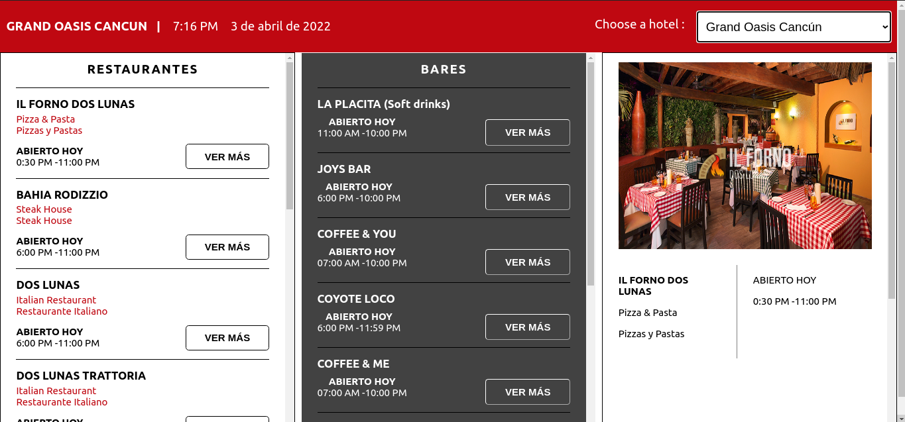

<<<<<<< Updated upstream
# Grand-Oasis-Cancun-Test
Grand Oasis Cancun Test
=======
## GRAND CARIBE CANCUN TEST DEVELOPER


## Introducción

Todos los hoteles del grupo oasis tienen centros de consumo estos se clasifican en Restaurantes y Bares se necesita crear una vista que contenga 3 columnas con lo siguiente:
 

1) Primer columna
    -   Listar todos los Restaurantes del Grand oasis Cancún
    -   Mostrar el nombre del restaurante
    -   Mostrar el concepto de su categoría
    -   Mostrar su horario
    -   Un botón de ver más

2) Segunda Columna
    -   Listar todos los Bares Grand oasis Cancún
    -   Mostrar el nombre del restaurante
    -   Mostrar su horario
    -   Un botón de ver más

3) Tercer columna
    -   Esta columna es la de detalle debe mostrar información cuando le den click al botón ver más de las columnas anteriores
    -   Nombre del centro de consumo
    -   Concepto
    -   Logo
    -   Imagen de portada 
    -   Mostrar su horario


## Requerimientos

* Generar un Api:  Se adjunta una base de datos msyql para que generen sus endpoints en el lenguaje que deseen.
 

* Consumir el Api: Consumir sus endpoints de preferencia con React  o algún Framework de su preferencia (Angular o Vue)

## Demo

- [Demo](https://aquamarine-mooncake-733b87.netlify.app/)
- [Repository](https://github.com/JJWizardMP/Grand-Oasis-Cancun-Test)

## Imágenes

### Vista de la tabla



## Tecnologías usadas

#### FRONTEND
| [React](https://reactjs.org/) |  [React Dom](https://es.reactjs.org/docs/react-dom.html) | [Axios](https://www.npmjs.com/package/axios)  |
| :-: | :-: | :-: |

#### BACKEND

| [Node](http://nodejs.org/) | [Mysql2](https://github.com/postmanlabs) | [Sequelize](https://github.com/postmanlabs) | [Express](https://github.com/postmanlabs)  |
| :-: | :-: | :-: | :-: |

## Instalar aplicación


### Back End:

Para arrancarlo debes moverte a la carpeta "backend" y ejecutar el siguiente comando para instalar las dependencias:

```sh
$ npm install 
```

Ahora se arracan el servidor del backend con el siguiente comando:

```sh
$ npm start 
```


### Front End: 

Para arrancarlo debes moverte a la carpeta "frontend" y ejecutar el siguiente comando para instalar las dependencias:

```sh
$ npm install 
```

Ahora se arracan el servidor del frontend con el siguiente comando:

```sh
$ npm start 
```
Esta aplicación fue creada con:

```sh
$ create-react-app
``` 

## Contribuidores

Este proyecto fue realizado por:
- FULLSTACK :
  - [Joan de Jesús Méndez Pool](https://github.com/JJWizardMP)
>>>>>>> Stashed changes
